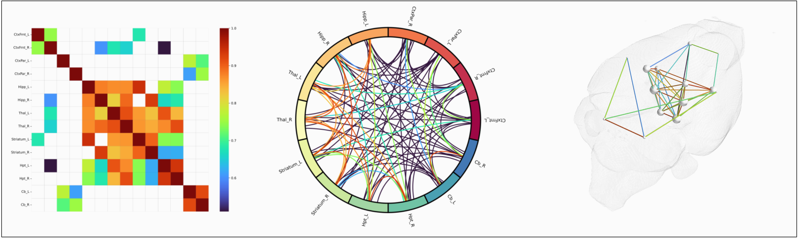

# PyMBN: Python Multiple-Sampling Brain Networks 🧠

[](https://www.python.org/downloads/release/python-3100/)

PyMBN is a Python implementation of the Multiple Sampling (MS) scheme for constructing stable Metabolic Brain Networks, as proposed in our [research paper](https://doi.org/10.1101/2021.03.16.435674).


## 🚀 Features

- Multiple Sampling scheme implementation for stable network construction
- Graph theoretical measures computation [WIP]
- Network visualization tools
- Statistical analysis utilities




## 🔧 Installation

1. **Set up Conda Environment**
```bash
# Create and activate conda environment
conda create -n pymbn python=3.10 pip
conda activate pymbn

# Install dependencies
pip install -r requirements.txt --no-deps
```

2. **Install System Dependencies** (Ubuntu/Debian)
```bash
sudo apt-get install python3-pyqt5.qtsvg libxcb-xinerama0
```

## 💻 Usage

1. **Activate Environment**
```bash
conda activate pymbn
```

2. **Run Analysis**
```bash
python main.py
```

Results will be available in the `results/` and `outputs/` directories.


## 📖 Methods
For detailed methodology, please refer to our paper: [Stable brain PET metabolic networks using a multiple sampling scheme](https://doi.org/10.1101/2021.03.16.435674)

## 📬 Contact
Guilherme Schu - guischu09@gmail.com